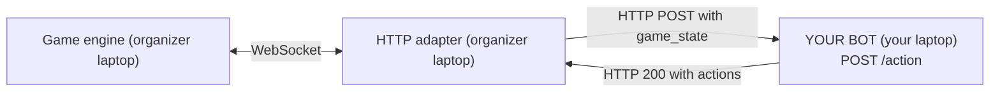

# Overview — what you're building

You're writing **one HTTP endpoint**: `POST /action`.

On every game tick, the organizer's server will send you the full game state in JSON. You reply with a list of actions, one per unit you own. That's it.

- **Language**: any. Pick whatever you're fastest in.
- **Framework**: any. Stdlib is enough.
- **Deployment**: run your bot on your own machine, bind to `0.0.0.0:8080`, tell the organizer your IP.

## Architecture

You never speak WebSocket. You never run the engine. The adapter does both for you. All you ship is an HTTP server that replies to `/action` in ≤ 300 ms.

## Match settings

- **1v1**: your agent ("A" or "B") plays against one other agent.
- You control **3 units** (Bomberman-style characters). Units have IDs like `c`, `e`, `g` (for agent A) or `d`, `f`, `h` (for agent B).
- Map is **15 x 15**, symmetric.
- Tick rate is **3 Hz** (≈ 330 ms per tick). Your per-tick HTTP call must return in ≤ 300 ms.
- A match lasts up to **300 ticks** (~100 s) before the closing ring-of-fire kills stragglers.
- **Language is free**, but your bot must be reachable on the LAN.

## Victory condition

The last agent with at least one surviving unit wins. Ties can happen; the game engine decides them.

## What counts as a turn

Each tick:

1. You receive the full `game_state` via HTTP.
2. You have up to 300 ms to reply with actions for your (still-alive) units.
3. The engine applies everyone's actions simultaneously.
4. Bombs fuse, fires burn, blocks fall, units move.

No action (timeout, bad response, crash) = your units **stay put** for that tick. You won't be disqualified for a slow tick — only for being unreachable long enough to lose on the board.

## Next

Read the [game rules](02-game-rules.md) to learn what your bot is actually playing.
