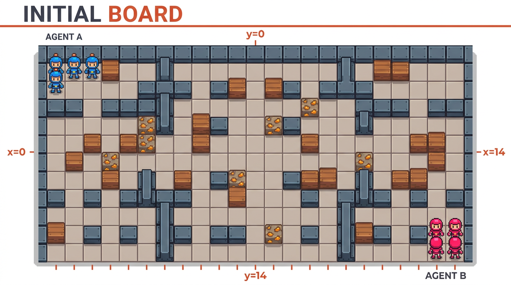
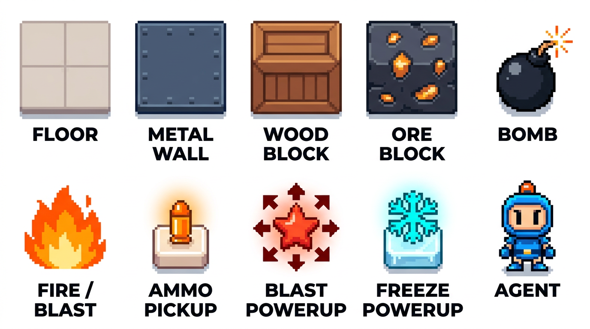
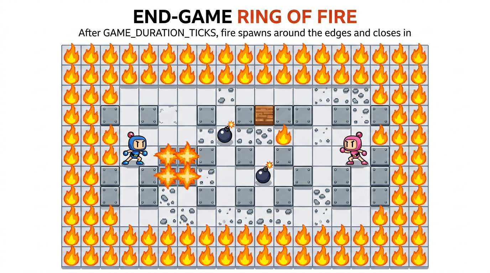

# Game rules

## The board

A 15 x 15 top-down grid. X goes from 0 (left) to 14 (right). Y goes from 0 (top) to 14 (bottom). Each tile holds **at most one block** (but can hold multiple entities like a bomb + a powerup temporarily, or units standing on floor).

Your three units spawn clustered in one corner of the map; the opponent's three spawn in the diagonally opposite corner. The map is symmetric across the center.

## Tile / entity legend

| Tile             | Walkable? | Destructible? | Drops items? |
|------------------|-----------|---------------|--------------|
| Floor            | yes       | —             | —            |
| Metal wall       | no        | no            | —            |
| Wood block       | no        | yes (1 HP)    | sometimes    |
| Ore block        | no        | yes (multiple HP) | sometimes |
| Bomb             | no        | yes (by fire) | —            |
| Fire / blast     | walkable but deadly | —     | —            |
| Ammo pickup      | yes       | —             | +1 bomb in inventory |
| Blast powerup    | yes       | —             | +1 blast diameter |
| Freeze powerup   | yes       | —             | stuns enemy units temporarily |

"Drops items?" means: when the block is destroyed by a blast, it *may* spawn a random pickup on its former tile.

## Per-unit properties

Each unit has:

- `coordinates`: `[x, y]` — its current tile
- `hp`: **3** at spawn. Losing it to a blast means the unit dies permanently.
- `inventory.bombs`: how many bombs it can still place simultaneously. Starts at 3.
- `blast_diameter`: **3** by default (= 1 tile radius around the bomb). Grows with blast powerups.
- `invulnerable`: tick number until which the unit cannot be damaged (used right after respawn / damage).
- `stunned`: tick number until which the unit cannot act (used after a freeze powerup hit).

Your three units start identical but drift apart as they pick up different items.

## Match flow

1. **Setup**: engine generates a symmetric board, spawns units, announces the full initial `game_state`.
2. **Play**: at each tick, both agents submit actions; the engine applies them.
3. **End-game**: after `GAME_DURATION_TICKS` (= 300 ticks in our config), the engine starts spawning fire along the outer rings, shrinking the play area until someone wins.

## Victory

The agent with at least one surviving unit at the end wins. Simultaneous deaths or timeout at equal unit counts = draw (the engine decides based on total HP as a tiebreaker).

## Next

Read [bombs and fire](03-bombs-and-fire.md) — they are how you kill things and also how you get killed.
