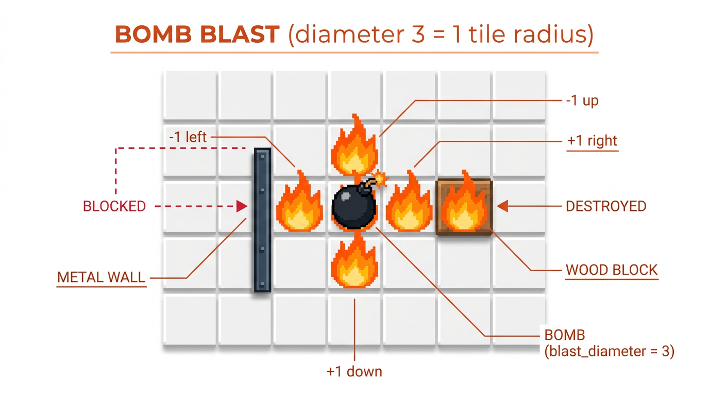
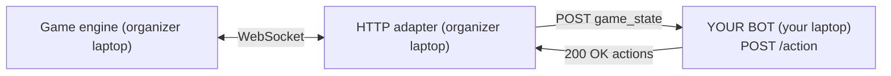

<!-- Slide 1 -->

# Bomberman Offsite

### Write a bot. Beat your colleagues. Win glory.

<br>

**Agenda**

1. The challenge
2. Rules (board, bombs, victory)
3. Your job: one HTTP endpoint
4. REST contract + `game_state`
5. Actions cheatsheet
6. Quickstart
7. Test against the reference AI
8. Day schedule + tournament format
9. Q&A

---

<!-- Slide 2 -->

# The challenge, in one picture


You control the **three units in one corner**. So does your opponent. Outlast them.

---

<!-- Slide 3 -->

## Rule 1 — The board

- 15 × 15 grid, fully symmetric
- You get 3 units, they get 3 units
- Tile types: floor, metal wall (solid), wood block (destructible), ore block (tough), powerups, bombs, fire


---

<!-- Slide 4 -->

## Rule 2 — Bombs and blast



- `+` pattern, radius = `(blast_diameter - 1) / 2`
- Blast stops at solid blocks (the boundary block takes damage anyway)
- Destroying blocks **sometimes drops powerups**
- Bombs can **chain-react** with each other
- You can **remotely detonate** your own bombs after a 5-tick arming delay

---

<!-- Slide 5 -->

## Rule 3 — Victory

<div class="columns">

**How you win**

- Be the last agent with ≥ 1 surviving unit
- Each unit starts at 3 HP
- Short invulnerability window after each hit prevents double-damage

**How you lose**

- All three of your units die
- You stand still while the ring of fire closes in
- You don't pay attention to chain reactions

</div>

<br>


---

<!-- Slide 6 -->

# Your job: one HTTP endpoint



- **You never touch WebSockets or the engine.** The adapter does.
- **You expose `POST /action`.** Any language, any framework, any host on the LAN.
- **You have 300 ms per tick** to reply. Tick rate is 3 Hz.

---

<!-- Slide 7 -->

## The REST contract (1/2) — the request

Every tick, you receive:

```json
{
  "tick": 42,
  "you":  "a",
  "game_state": {
    "agents":     { "a": { "unit_ids": ["c","e","g"] }, "b": {...} },
    "unit_state": { "c": { "coordinates": [1,1], "hp": 3, ... }, ... },
    "entities":   [ { "x":5, "y":5, "type":"m" }, ... ],
    "world":      { "width": 15, "height": 15 },
    "tick":       42,
    "config":     { "tick_rate_hz": 3, "game_duration_ticks": 300, ... }
  }
}
```

`you` tells you which agent you're playing (`"a"` or `"b"`).

---

<!-- Slide 8 -->

## The REST contract (2/2) — your reply

```json
{
  "actions": [
    { "unit_id": "c", "action": "up" },
    { "unit_id": "e", "action": "bomb" },
    { "unit_id": "g", "action": "detonate", "coordinates": [5, 7] }
  ]
}
```

- **Only list your own unit IDs.** Anything else is dropped.
- **Units you don't list** default to `stay`.
- **Don't respond in 300 ms?** Your units stay. Match continues.

---

<!-- Slide 9 -->

## `game_state` in two slides (1/2) — units and agents

```json
"agents":     { "a": { "agent_id": "a", "unit_ids": ["c","e","g"] } }

"unit_state": {
  "c": {
    "coordinates":    [1, 1],
    "hp":             3,
    "inventory":      { "bombs": 3 },
    "blast_diameter": 3,
    "invulnerable":   0,
    "stunned":        0
  }
}
```

- `invulnerable` / `stunned` are **tick numbers**, not durations.
- Dead units are **removed** from `unit_state`. Check before you access.

---

<!-- Slide 10 -->

## `game_state` in two slides (2/2) — entities

```json
"entities": [
  { "x":  5, "y":  5, "type": "m" },                              // metal wall
  { "x":  2, "y":  1, "type": "w", "hp": 1 },                     // wood block
  { "x":  9, "y":  3, "type": "o", "hp": 3 },                     // ore block
  { "x":  4, "y":  4, "type": "b", "expires": 70, "blast_diameter": 3,
    "owner_unit_id": "c" },                                       // bomb
  { "x":  4, "y":  3, "type": "x", "expires": 65 },               // fire
  { "x":  7, "y":  7, "type": "a" },                              // ammo pickup
  { "x":  8, "y":  8, "type": "bp" },                             // blast powerup
  { "x":  9, "y":  9, "type": "fp" }                              // freeze powerup
]
```

Key formula: `ticks_until_boom = bomb.expires - game_state.tick`

---

<!-- Slide 11 -->

## Actions cheatsheet

| Action     | Effect                                                  | Notes                          |
|------------|----------------------------------------------------------|--------------------------------|
| `up` / `down` / `left` / `right` | Move 1 tile                            | Invalid = unit stays put       |
| `bomb`     | Place a bomb on current tile                             | Needs `inventory.bombs >= 1`   |
| `detonate` | Pop one of your bombs now                                | Requires `coordinates: [x,y]`  |
| `stay`     | No-op                                                    | Default for listed-but-silent  |

One action per unit, per tick. Movement is **one tile at a time**. Bomb fuse is 30 ticks (~10 s).

---

<!-- Slide 12 -->

## Quickstart — Python stub (stdlib only)

```python
import json, random
from http.server import BaseHTTPRequestHandler, HTTPServer

ACTIONS = ["up", "down", "left", "right", "bomb", "stay"]


class H(BaseHTTPRequestHandler):
    def do_POST(self):
        n = int(self.headers.get("Content-Length", "0"))
        p = json.loads(self.rfile.read(n) or b"{}")
        me = p.get("you", "a")
        ids = p["game_state"]["agents"][me]["unit_ids"]
        body = json.dumps({"actions": [{"unit_id": u, "action": random.choice(ACTIONS)} for u in ids]}).encode()
        self.send_response(200); self.send_header("Content-Type","application/json"); self.end_headers(); self.wfile.write(body)


HTTPServer(("0.0.0.0", 8080), H).serve_forever()
```

30 lines. Bind to **`0.0.0.0`**. Port **8080**.

---

<!-- Slide 13 -->

## Quickstart — Node stub (no deps)

```javascript
import http from "node:http";
const ACTIONS = ["up","down","left","right","bomb","stay"];
const pick = (a) => a[Math.floor(Math.random() * a.length)];

http.createServer((req, res) => {
  if (req.method !== "POST" || req.url !== "/action") return res.writeHead(404).end();
  let raw = "";
  req.on("data", (c) => (raw += c));
  req.on("end", () => {
    const { you = "a", game_state } = JSON.parse(raw || "{}");
    const ids = game_state.agents[you].unit_ids;
    const actions = ids.map((unit_id) => ({ unit_id, action: pick(ACTIONS) }));
    res.writeHead(200, { "Content-Type": "application/json" }).end(JSON.stringify({ actions }));
  });
}).listen(8080);
```

25 lines. Same idea. Any language works.

---

<!-- Slide 14 -->

## Smoke-test before you plug in

```bash
curl -s localhost:8080/action \
  -H 'Content-Type: application/json' \
  -d '{"tick":0,"you":"a","game_state":{"agents":{"a":{"unit_ids":["c","e","g"]}}}}'
```

Expected shape:

```json
{"actions":[{"unit_id":"c","action":"up"},{"unit_id":"e","action":"bomb"},{"unit_id":"g","action":"stay"}]}
```

If `curl` works locally, ask the organizer to hit you from the LAN.

---

<!-- Slide 15 -->

## Scrimmage against the reference AI

Reference AI URL (on the whiteboard / kickoff):

```
http://<organizer-ip>:8080/action
```

Request a scrimmage — the organizer runs:

```bash
python3 match-runner/run_match.py \
  --team-a http://<your-ip>:8080/action --name-a "<your team>" \
  --team-b http://<ref-ai-url>/action   --name-b "reference-ai"
```

You get `winner`, `last_tick`, and a replay. Beat the reference AI consistently = you're in the bracket.

---

<!-- Slide 16 -->

## Top strategic hints

- **Danger map first, actions second.** Never step on a tile that will be fire in ≤ 6 ticks.
- **Don't bomb if you can't escape.** Simulate your own blast, BFS from your tile to a safe tile within the fuse.
- **Mining wood blocks > chasing enemies** early game (powerups!).
- **Chain reactions** — pop enemy bombs with yours for surprise kills.
- **Freeze powerups are OP.** 15 ticks of stun is a lifetime.
- **Be center-of-board by tick 250.** The ring of fire doesn't care about your PR.

---

<!-- Slide 17 -->

## Day schedule

| When           | What                                       |
|----------------|--------------------------------------------|
| Now            | Kickoff (this deck)                         |
| +30 min        | Coding starts. Each team on their own machine. |
| +1h / +2h      | Walk-around scrimmages vs. reference AI    |
| +30 min before | Freeze submissions, last testing window    |
| Afternoon      | 1v1 tournament on the big screen           |
| End            | Finals + exhibition vs. reference AI + prizes |

**Tournament format**: 1v1 matches. Pools / bracket run by the organizer. Best-of-N finals.

---

<!-- Slide 18 -->

## Rules recap — pinned on the whiteboard

- **Your endpoint**: `POST /action`
- **Port**: `8080`
- **Bind to**: `0.0.0.0`
- **Language**: any
- **Timeout**: 300 ms per tick
- **Reference AI**: `http://<organizer-ip>:8080/action`
- **Team docs**: `docs/teams/` (printed handout + link)
- **Example stubs**: `example-bots/python/` and `example-bots/node/`

---

<!-- Slide 19 -->

# Q&A

### Then: go code something evil.

<br>
<br>
<br>

<span class="muted">Full docs: `docs/teams/01-overview.md` → `docs/teams/09-tips-and-faq.md`</span>
